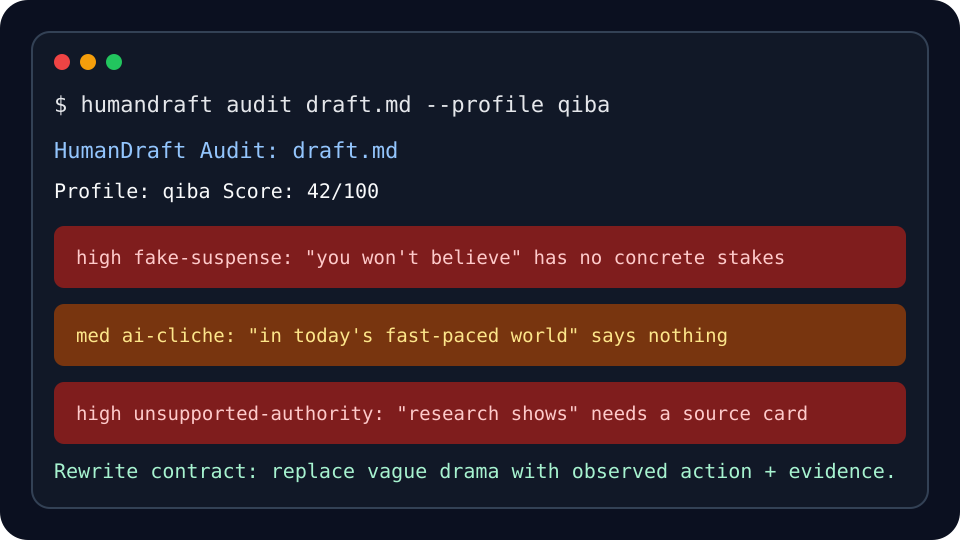

<p align="center">
  
</p>

<p align="center">
  <strong>An open-source writing critique engine for catching AI slop before readers do.</strong>
</p>

<p align="center">
  <a href="https://github.com/fzxlyd/humandraft/actions"></a>
  <a href="LICENSE"></a>
  
  
</p>

HumanDraft is not another "AI writer." It is a review engine for people who already use LLMs but do not trust the way LLMs write.

It audits drafts for the problems humans notice immediately:

- fake suspense with no concrete stakes
- generic AI connective tissue
- unsupported authority language
- characters acting like prompt variables
- scene logic that ignores ordinary human behavior
- abstract emotion where a real action should be
- claims that need evidence before publication

HumanDraft starts with critique because generation is already cheap. Judgment is the scarce part.

<p align="center">
  
</p>

## Why HumanDraft Exists

Most AI writing tools optimize for volume. They produce text that looks complete but reads like it was assembled from safe averages:

```text
In today's fast-paced world, you won't believe the shocking truth...
Research shows that this deeply resonates with modern audiences...
```

HumanDraft treats those phrases as bugs, not style.

The first release is a deterministic CLI that finds visible writing failures and turns them into a rewrite contract. LLM-based rewriting can come later, but the review layer should remain inspectable, testable, and portable.

## What It Does Today

HumanDraft currently ships with:

- a local CLI
- `npx humandraft ...` command shape
- one-line demand to structured brief generation
- structured brief-to-draft composition
- templates for short video, public-account articles, oral scripts, stories, and science explainers
- quality gates inspired by serious writing pipelines: blockers, warnings, scoring, and deslop checks
- style packs for plain, oral, elevated, and taste-first writing
- built-in anti-slop rules
- profile-specific checks
- Markdown reports
- a local Web UI
- starter VS Code and Obsidian integrations
- a `qiba` profile for food-science short-video scripts
- regression tests
- documentation for the broader product direction

Example:

```bash
npx humandraft audit samples/qiba-ai-ish.md --profile qiba
```

Run the full gate before publishing:

```bash
npx humandraft gate draft.md --profile qiba
```

Score the draft against a writing rubric:

```bash
npx humandraft score draft.md --profile qiba
```

Run the deslop gate stack:

```bash
npx humandraft deslop draft.md
```

Initialize a project bible and tracking files:

```bash
npx humandraft init ./qiba-project --profile qiba
```

Compose from a structured brief:

```bash
npx humandraft compose samples/brief-qiba-soup.json --style oral --profile qiba
```

Generate a brief from one line:

```bash
npx humandraft brief "琦爸酒食，给我故事：骨头汤补钙" --profile qiba --template story
```

Generate a draft from one line:

```bash
npx humandraft write "琦爸酒食，给我故事：骨头汤补钙" --profile qiba --template story
```

Run the local Web UI:

```bash
npx humandraft web --port 8787
```

Output:

```text
HumanDraft Audit: qiba-ai-ish.md
Profile: qiba
Score: 0/100

high    fake-suspense          "你绝对想不到"
medium  ai-cliche              "在这个快节奏的时代"
high    unsupported-authority  "科学研究表明"
high    teacher-scold          "你们都错了"

Rewrite contract:
Replace vague drama with observed action, source-backed claims, and a calmer voice.
```

## Quick Start

```bash
git clone https://github.com/fzxlyd/humandraft.git
cd humandraft
npm test
npm link
humandraft audit samples/qiba-ai-ish.md --profile qiba
humandraft web
```

Before the package is published to npm, remote users can run the GitHub version:

```bash
npx github:fzxlyd/humandraft write "琦爸酒食，给我故事：隔夜菜到底能不能吃" --profile qiba --template story
```

No API key is required for the current audit engine.

## Profiles

| Profile | Purpose |
|---|---|
| `general` | Broad anti-slop and clarity checks |
| `qiba` | Food-science short-video script checks |
| `story` | Early causality and reveal checks |
| `research` | Evidence and citation-risk checks |

## Style Packs

| Style | Use It When You Need |
|---|---|
| `plain` | clear human language without official tone |
| `oral` | a script that can be read aloud naturally |
| `elevated` | a calmer, more editorial voice |
| `taste` | stronger imagery, texture, and memorability |

## Templates

| Template | Use It For |
|---|---|
| `short-video` | visible short-video scripts with beats and shot hints |
| `public-account` | WeChat/public-account article drafts |
| `oral-script` | speakable口播稿 |
| `story` | human situations, pressure, turn, and aftertaste |
| `science` | evidence-bounded explainers |

## What HumanDraft Catches

| Failure | Example | Why It Matters |
|---|---|---|
| Fake suspense | `you won't believe`, `你绝对想不到` | Teases drama without earning attention |
| AI cliche | `in today's fast-paced world`, `值得注意的是` | Sounds polished but says nothing |
| Unsupported authority | `research shows`, `科学研究表明` | Claims authority without evidence |
| Scolding voice | `you are wrong`, `你们都错了` | Makes the reader defensive |
| Empty emotion | `heartwarming`, `让人泪目` | Names emotion instead of showing it |
| Abstraction overload | too many labels, not enough action | Readers cannot see the scene |

## What Makes It Different

HumanDraft is not a replacement for humanizer tools. Humanizers usually rewrite the surface of a draft. HumanDraft tries to expose the failure underneath.

| Tool Type | What It Usually Does | HumanDraft's Difference |
|---|---|---|
| Humanizer | Rewrites text to sound less AI-generated | Shows the exact rule, evidence, and reason before rewriting |
| AI detector | Scores whether text looks AI-written | Turns the diagnosis into actionable editorial tasks |
| Prompt enhancer | Improves the starting prompt | Audits drafts after generation and supports reusable rule packs |
| Taste/style skill | Adds voice, texture, or memorability | Makes taste criteria inspectable and testable |
| Full writing agent | Automates the whole writing pipeline | Keeps critique separate from generation so the writer stays in control |

See [docs/positioning.md](docs/positioning.md) for the broader category map.

HumanDraft borrows the best ideas from stronger open-source writing and research systems:

- [PaperDebugger](https://github.com/PaperDebugger/paperdebugger): editor-side multi-agent review
- [avoid-ai-writing](https://github.com/conorbronsdon/avoid-ai-writing): explicit anti-AI-writing audits
- [STORM](https://github.com/stanford-oval/storm): research-first drafting with citations
- [GPT Researcher](https://github.com/assafelovic/gpt-researcher): source gathering before synthesis
- [saga](https://github.com/Lanerra/saga): memory and knowledge-graph direction for long-form writing
- [Libriscribe](https://github.com/guerra2fernando/libriscribe): multi-stage book workflow
- [WritingTools](https://github.com/theJayTea/WritingTools): system-wide writing utilities
- [Vale](https://github.com/vale-cli/vale): configurable prose linting

The synthesis is simple:

```text
brief -> prompt enhancement -> style pack -> draft -> critique -> rewrite contract -> constrained rewrite
```

The current MVP implements the critique layer and the first draft-composition skeleton.

## Project Structure

```text
assets/
  logo.svg              Project logo
  terminal-demo.svg     README demo graphic
docs/
  architecture.md       System design
  integrations.md       CLI, Web UI, and editor integration notes
  landscape.md          Open-source project analysis
  positioning.md        Category map and differentiation
  product-blueprint.md  Product thesis and roadmap
  project-catalog.md    Project-by-project notes
  zh-CN.md              Chinese introduction
src/
  audit.mjs             Rule engine
  brief.mjs             One-line demand to structured brief
  cli.mjs               CLI entry point
  compose.mjs           Brief-to-draft pipeline skeleton
  deslop-gates.mjs      Six-gate anti-slop diagnosis
  gate.mjs              Unified blockers/warnings quality gate
  project-bible.mjs     Project bible and tracking scaffold
  report.mjs            Markdown report rendering
  rules.mjs             Built-in rule catalog
  score.mjs             Deterministic writing score rubric
  style-packs.mjs       Built-in writing styles
  templates.mjs         Built-in writing templates
  server.mjs            Local Web UI and JSON endpoints
web/
  index.html            Browser UI
integrations/
  vscode/               VS Code starter extension
  obsidian/             Obsidian starter plugin
samples/
  brief-qiba-soup.json  Example structured writing brief
  qiba-ai-ish.md        Example text to audit
test/
  audit.test.mjs        Minimal regression tests
```

## Roadmap

See [ROADMAP.md](ROADMAP.md).

Near-term priorities:

- load custom rule packs
- add stronger `story` and `research` profiles
- generate rewrite contracts from findings
- support JSON output for editor integrations
- harden VS Code / Obsidian integrations into packaged releases
- make project-bible files feed back into `brief`, `write`, and `gate`

## 中文说明

中文介绍见 [docs/zh-CN.md](docs/zh-CN.md)。

HumanDraft 的核心不是“帮你一键生成文章”，而是帮你抓出 AI 文本里最容易被人看穿的问题：假悬念、空话、无证据权威口吻、人物没常识、因果断裂。

## Using It For Story Projects

See [docs/using-for-our-stories.md](docs/using-for-our-stories.md) for a practical workflow for projects like `琦爸酒食` and `7号关口`.

Example:

```bash
npx humandraft compose samples/brief-qiba-story.json --style oral --profile qiba
npx humandraft compose samples/brief-gate7.json --style elevated --profile story
npx humandraft write "琦爸酒食，给我故事：骨头汤补钙" --profile qiba --template story
```

## Contributing

Useful contributions include:

- new anti-slop rules
- false-positive tests
- domain profiles
- better report wording
- editor integrations
- examples of bad drafts and improved rewrites

See [CONTRIBUTING.md](CONTRIBUTING.md).

## License

MIT. See [LICENSE](LICENSE).
